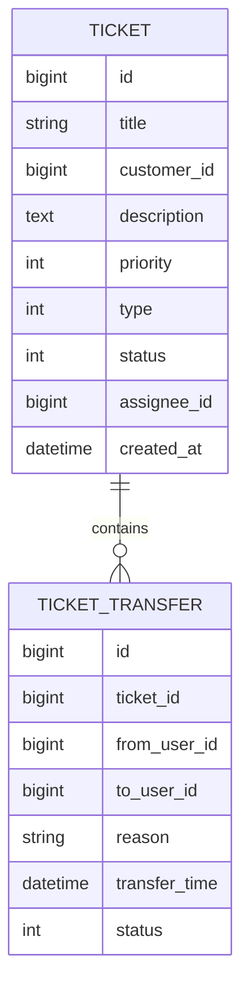
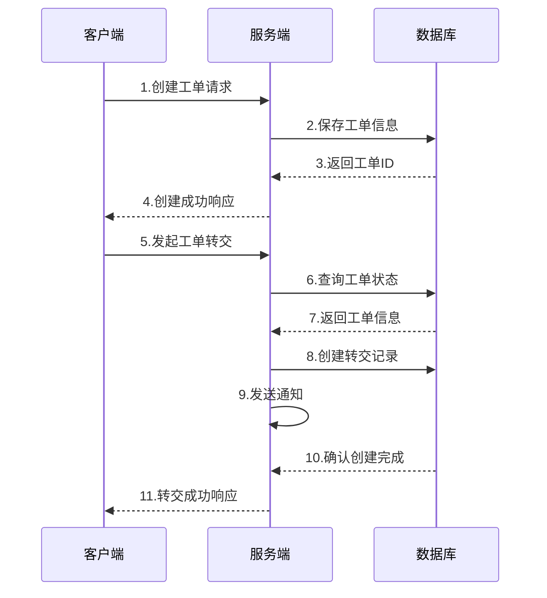

# 咨询工单转交系统概要设计文档

## 文档信息
- 作者：小强
- 最后更新日期：2025-03-21
- 文档状态：已评审

## 1. 数据结构设计

### 1.1 工单表(ticket)
```sql
CREATE TABLE `ticket` (
  `id` bigint NOT NULL AUTO_INCREMENT COMMENT '工单ID',
  `title` varchar(200) NOT NULL COMMENT '工单标题',
  `customer_id` bigint NOT NULL COMMENT '客户ID',
  `description` text COMMENT '问题描述',
  `priority` tinyint NOT NULL DEFAULT '0' COMMENT '优先级:0-普通,1-中等,2-紧急',
  `type` tinyint NOT NULL COMMENT '工单类型:0-咨询,1-投诉,2-建议,3-其他',
  `status` tinyint NOT NULL DEFAULT '0' COMMENT '状态:0-待处理,1-处理中,2-已完成',
  `assignee_id` bigint COMMENT '处理人ID',
  `created_at` datetime NOT NULL DEFAULT CURRENT_TIMESTAMP COMMENT '创建时间',
  `updated_at` datetime NOT NULL DEFAULT CURRENT_TIMESTAMP ON UPDATE CURRENT_TIMESTAMP COMMENT '更新时间',
  PRIMARY KEY (`id`),
  KEY `idx_customer` (`customer_id`),
  KEY `idx_assignee` (`assignee_id`)
) ENGINE=InnoDB DEFAULT CHARSET=utf8mb4 COMMENT='工单表';
```

### 1.2 工单转交记录表(ticket_transfer)
```sql
CREATE TABLE `ticket_transfer` (
  `id` bigint NOT NULL AUTO_INCREMENT COMMENT '记录ID',
  `ticket_id` bigint NOT NULL COMMENT '工单ID',
  `from_user_id` bigint NOT NULL COMMENT '转交人ID',
  `to_user_id` bigint NOT NULL COMMENT '接收人ID',
  `reason` varchar(500) NOT NULL COMMENT '转交原因',
  `transfer_time` datetime NOT NULL DEFAULT CURRENT_TIMESTAMP COMMENT '转交时间',
  `status` tinyint NOT NULL DEFAULT '0' COMMENT '状态:0-待确认,1-已确认,2-已拒绝',
  PRIMARY KEY (`id`),
  KEY `idx_ticket` (`ticket_id`),
  FOREIGN KEY (`ticket_id`) REFERENCES `ticket` (`id`)
) ENGINE=InnoDB DEFAULT CHARSET=utf8mb4 COMMENT='工单转交记录表';
```

## 2. 实体关系图



## 3. 核心流程时序图



## 4. 关键接口设计

### 4.1 创建工单

```
POST /api/v1/tickets

Request:
{
    "title": "string",
    "customerId": "long",
    "description": "string",
    "priority": "int",
    "type": "int"
}

Response:
{
    "code": 0,
    "message": "success",
    "data": {
        "ticketId": "long"
    }
}
```

### 4.2 转交工单

```
POST /api/v1/tickets/{ticketId}/transfer

Request:
{
    "toUserId": "long",
    "reason": "string"
}

Response:
{
    "code": 0,
    "message": "success",
    "data": {
        "transferId": "long"
    }
}
```

### 4.3 确认工单转交

```
PUT /api/v1/tickets/transfer/{transferId}/confirm

Response:
{
    "code": 0,
    "message": "success"
}
```

### 4.4 查询工单列表

```
GET /api/v1/tickets?page=1&size=10

Response:
{
    "code": 0,
    "message": "success", 
    "data": {
        "total": "long",
        "items": [{
            "id": "long",
            "title": "string",
            "status": "int",
            "priority": "int",
            "createTime": "datetime"
        }]
    }
}
```