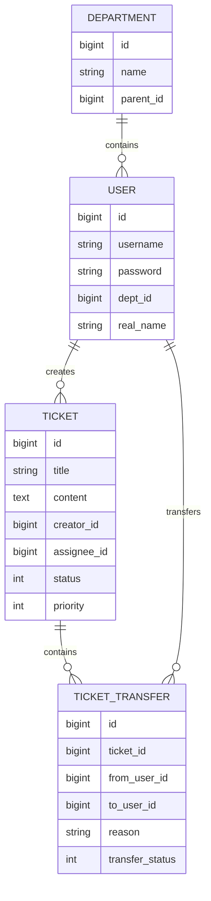
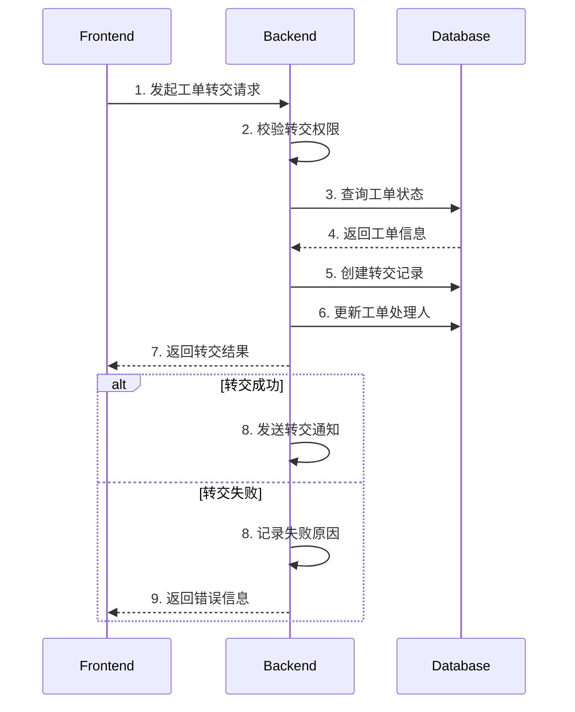

# 工单转交系统概要设计文档

作者: 小强
更新日期: 2025-03-21

## 1. 数据结构设计

### 1.1 工单表(ticket)
```sql
CREATE TABLE `ticket` (
  `id` bigint(20) NOT NULL AUTO_INCREMENT COMMENT '主键ID',
  `title` varchar(200) NOT NULL COMMENT '工单标题',
  `content` text NOT NULL COMMENT '工单内容',
  `creator_id` bigint(20) NOT NULL COMMENT '创建人ID',
  `assignee_id` bigint(20) NOT NULL COMMENT '处理人ID',
  `status` tinyint(4) NOT NULL DEFAULT '0' COMMENT '状态:0-待处理,1-处理中,2-已完成',
  `priority` tinyint(4) NOT NULL DEFAULT '0' COMMENT '优先级:0-普通,1-紧急,2-特急',
  `created_at` datetime NOT NULL COMMENT '创建时间',
  `updated_at` datetime NOT NULL COMMENT '更新时间',
  `deleted_at` datetime DEFAULT NULL COMMENT '删除时间',
  PRIMARY KEY (`id`),
  KEY `idx_status_priority` (`status`,`priority`)
) ENGINE=InnoDB DEFAULT CHARSET=utf8mb4 COMMENT='工单表';
```

### 1.2 用户表(user)
```sql
CREATE TABLE `user` (
  `id` bigint(20) NOT NULL AUTO_INCREMENT COMMENT '主键ID',
  `username` varchar(50) NOT NULL COMMENT '用户名',
  `password` char(32) NOT NULL COMMENT '密码hash',
  `dept_id` bigint(20) NOT NULL COMMENT '部门ID',
  `real_name` varchar(50) NOT NULL COMMENT '真实姓名',
  `email` varchar(100) NOT NULL COMMENT '邮箱',
  `phone` varchar(20) NOT NULL COMMENT '手机号',
  `created_at` datetime NOT NULL COMMENT '创建时间',
  `updated_at` datetime NOT NULL COMMENT '更新时间',
  `deleted_at` datetime DEFAULT NULL COMMENT '删除时间',
  PRIMARY KEY (`id`),
  UNIQUE KEY `uk_username` (`username`)
) ENGINE=InnoDB DEFAULT CHARSET=utf8mb4 COMMENT='用户表';
```

### 1.3 工单转交表(ticket_transfer)
```sql
CREATE TABLE `ticket_transfer` (
  `id` bigint(20) NOT NULL AUTO_INCREMENT COMMENT '主键ID',
  `ticket_id` bigint(20) NOT NULL COMMENT '工单ID',  
  `from_user_id` bigint(20) NOT NULL COMMENT '转出人ID',
  `to_user_id` bigint(20) NOT NULL COMMENT '转入人ID',
  `reason` varchar(500) NOT NULL COMMENT '转交原因',
  `transfer_status` tinyint(4) NOT NULL DEFAULT '0' COMMENT '转交状态:0-待接收,1-已接收,2-已拒绝',
  `created_at` datetime NOT NULL COMMENT '创建时间',
  `updated_at` datetime NOT NULL COMMENT '更新时间',
  PRIMARY KEY (`id`),
  KEY `idx_ticket_id` (`ticket_id`)
) ENGINE=InnoDB DEFAULT CHARSET=utf8mb4 COMMENT='工单转交表';
```

### 1.4 部门表(department)
```sql
CREATE TABLE `department` (
  `id` bigint(20) NOT NULL AUTO_INCREMENT COMMENT '主键ID',
  `name` varchar(50) NOT NULL COMMENT '部门名称',
  `parent_id` bigint(20) DEFAULT NULL COMMENT '父部门ID',
  `created_at` datetime NOT NULL COMMENT '创建时间',
  `updated_at` datetime NOT NULL COMMENT '更新时间',
  `deleted_at` datetime DEFAULT NULL COMMENT '删除时间',
  PRIMARY KEY (`id`)
) ENGINE=InnoDB DEFAULT CHARSET=utf8mb4 COMMENT='部门表';
```

## 2. 实体关系图



## 3. 核心流程时序图



## 4. 关键接口设计

### 4.1 工单转交接口
```
POST /api/v1/tickets/{ticketId}/transfer

请求参数:
{
    "toUserId": "目标用户ID",
    "reason": "转交原因",
    "transferType": "转交类型:0-普通转交,1-强制转交"
}

响应格式:
{
    "code": 200,
    "message": "success",
    "data": {
        "transferId": "转交记录ID",
        "transferTime": "转交时间"
    }
}
```

### 4.2 工单列表查询接口
```
GET /api/v1/tickets

请求参数:
{
    "status": "工单状态",
    "priority": "优先级",
    "pageNum": "页码",
    "pageSize": "每页条数",
    "sortField": "排序字段",
    "sortOrder": "排序方式:asc/desc"
}

响应格式:
{
    "code": 200,
    "message": "success", 
    "data": {
        "total": "总条数",
        "list": [{
            "id": "工单ID",
            "title": "标题",
            "status": "状态",
            "priority": "优先级",
            "creatorName": "创建人",
            "assigneeName": "处理人",
            "createTime": "创建时间"
        }]
    }
}
```

### 4.3 工单转交撤销接口
```
POST /api/v1/tickets/{ticketId}/transfer/{transferId}/cancel

请求参数:
{
    "reason": "撤销原因"
}

响应格式:
{
    "code": 200,
    "message": "success",
    "data": {
        "cancelTime": "撤销时间"
    }
}
```