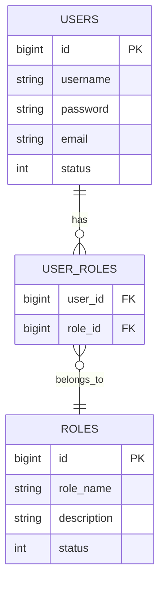
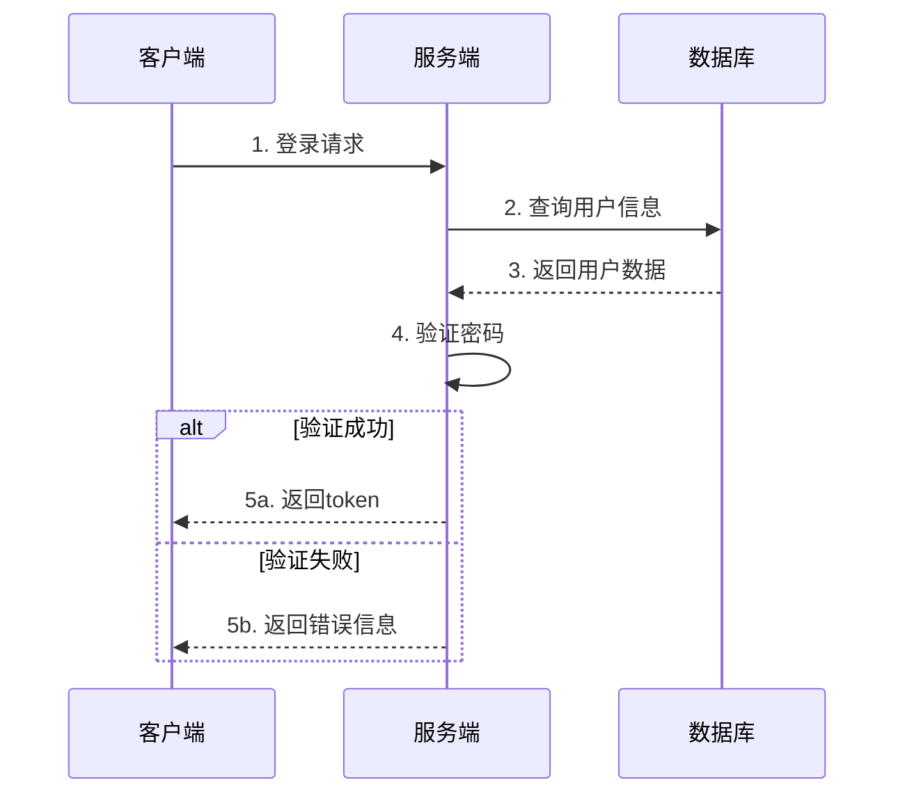

# 系统概要设计文档

## 文档信息
- 作者：小强
- 最后更新日期：2025-03-21

## 1. 数据结构设计

### 1.1 用户表(users)
```sql
CREATE TABLE users (
    id BIGINT PRIMARY KEY AUTO_INCREMENT COMMENT '用户ID',
    username VARCHAR(50) NOT NULL COMMENT '用户名',
    password VARCHAR(255) NOT NULL COMMENT '密码',
    email VARCHAR(100) NOT NULL COMMENT '邮箱',
    status TINYINT NOT NULL DEFAULT 1 COMMENT '状态: 1-正常 0-禁用',
    created_at TIMESTAMP NOT NULL DEFAULT CURRENT_TIMESTAMP COMMENT '创建时间',
    updated_at TIMESTAMP NOT NULL DEFAULT CURRENT_TIMESTAMP ON UPDATE CURRENT_TIMESTAMP COMMENT '更新时间',
    UNIQUE KEY uk_username (username),
    UNIQUE KEY uk_email (email)
) ENGINE=InnoDB DEFAULT CHARSET=utf8mb4 COMMENT='用户表';
```

### 1.2 角色表(roles)
```sql
CREATE TABLE roles (
    id BIGINT PRIMARY KEY AUTO_INCREMENT COMMENT '角色ID',
    role_name VARCHAR(50) NOT NULL COMMENT '角色名称',
    description VARCHAR(200) COMMENT '角色描述',
    status TINYINT NOT NULL DEFAULT 1 COMMENT '状态: 1-正常 0-禁用',
    created_at TIMESTAMP NOT NULL DEFAULT CURRENT_TIMESTAMP COMMENT '创建时间',
    updated_at TIMESTAMP NOT NULL DEFAULT CURRENT_TIMESTAMP ON UPDATE CURRENT_TIMESTAMP COMMENT '更新时间',
    UNIQUE KEY uk_role_name (role_name)
) ENGINE=InnoDB DEFAULT CHARSET=utf8mb4 COMMENT='角色表';
```

## 2. 实体关系图



## 3. 核心流程时序图



## 4. 关键接口设计

### 4.1 用户登录接口

- 路径: `/api/v1/auth/login`
- 方法: POST
- 请求格式:
```json
{
    "username": "string",
    "password": "string"
}
```
- 响应格式:
```json
{
    "code": 200,
    "message": "success",
    "data": {
        "token": "string",
        "userId": "number",
        "username": "string"
    }
}
```

### 4.2 用户信息查询接口

- 路径: `/api/v1/users/{id}`
- 方法: GET
- 请求参数: 
  - id: 用户ID
- 响应格式:
```json
{
    "code": 200,
    "message": "success",
    "data": {
        "id": "number",
        "username": "string",
        "email": "string",
        "status": "number"
    }
}
```