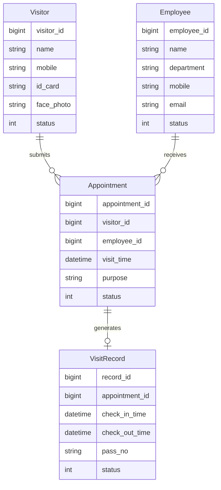
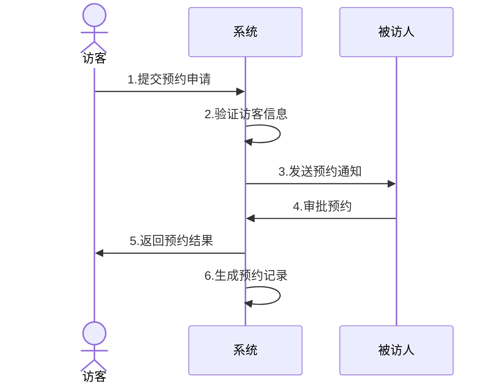
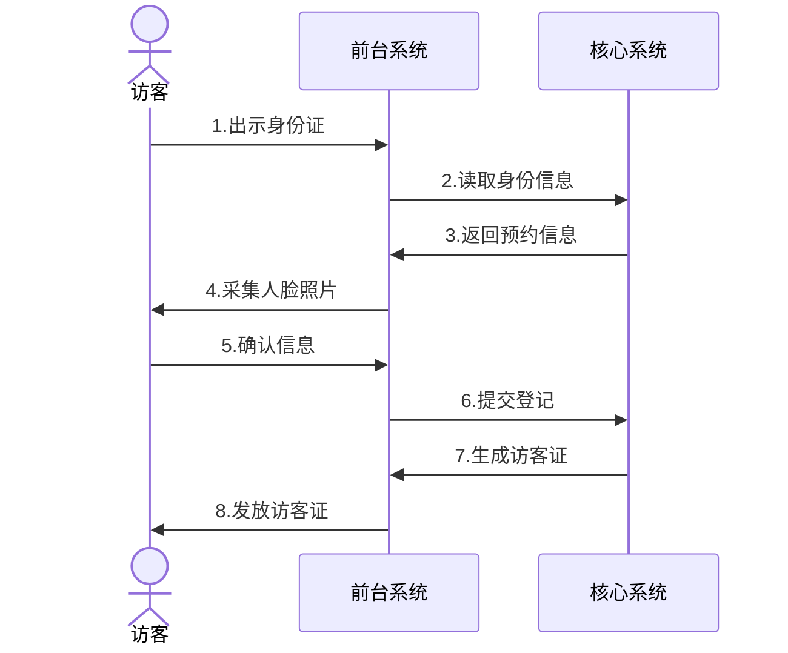
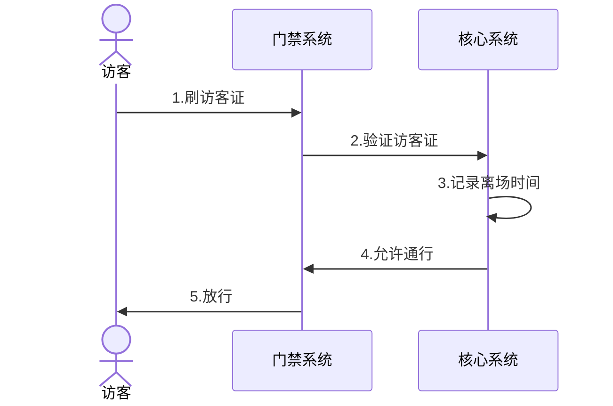

# 小鹏访客系统概要设计

## 1. 数据建模

### 1.1 核心实体定义
```sql
/*访客信息表*/
t_visitor {
  visitor_id: bigint[PK]    // 访客ID  
  name: varchar(50)         // 姓名
  mobile: varchar(20)      // 手机号
  id_card: varchar(18)     // 身份证号
  face_photo: varchar(200) // 人脸照片
  status: tinyint          // 状态
  create_time: datetime    // 创建时间
  update_time: datetime    // 更新时间
}

/*预约记录表*/  
t_appointment {
  appointment_id: bigint[PK]  // 预约ID
  visitor_id: bigint[FK]      // 访客ID
  employee_id: bigint[FK]     // 被访人ID  
  visit_time: datetime        // 来访时间
  purpose: varchar(200)       // 来访事由
  status: tinyint            // 状态
  create_time: datetime      // 创建时间
  update_time: datetime      // 更新时间
}

/*访问记录表*/
t_visit_record {
  record_id: bigint[PK]      // 记录ID
  appointment_id: bigint[FK]  // 预约ID
  check_in_time: datetime    // 进入时间
  check_out_time: datetime   // 离开时间  
  pass_no: varchar(50)       // 访客证号
  status: tinyint           // 状态
  create_time: datetime     // 创建时间
  update_time: datetime     // 更新时间
}

/*员工信息表*/
t_employee {
  employee_id: bigint[PK]  // 员工ID
  name: varchar(50)        // 姓名
  department: varchar(50)  // 部门
  mobile: varchar(20)     // 手机号
  email: varchar(50)      // 邮箱
  status: tinyint         // 状态
  create_time: datetime   // 创建时间
  update_time: datetime   // 更新时间
}
```

### 1.2 实体关系图


## 2. 核心流程时序图

### 2.1 访客预约流程


### 2.2 访客登记流程  


### 2.3 访客离场流程
