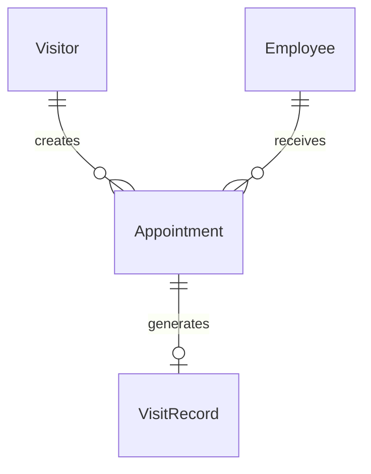
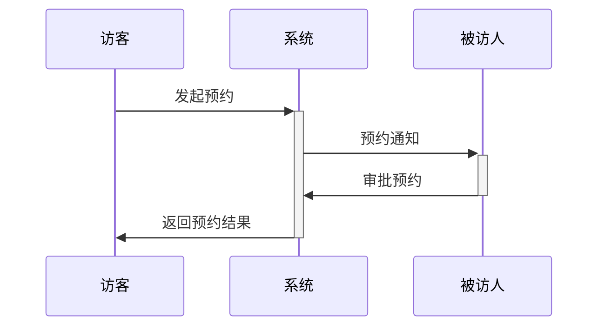
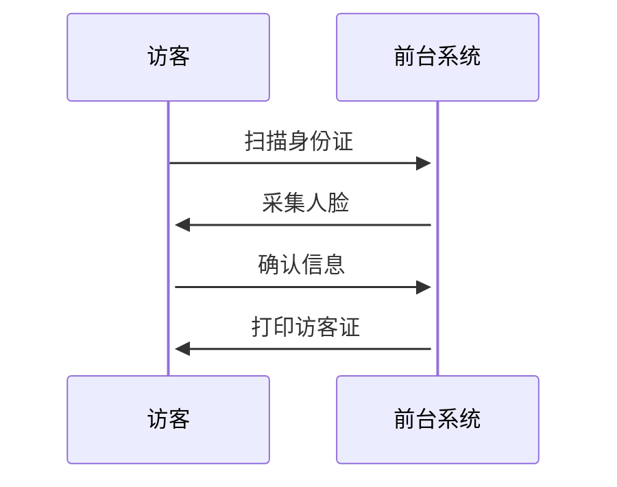

# 小鹏访客系统概要设计文档

## 1. 系统架构
### 1.1 技术架构
- 前端：Vue3 + Element Plus
- 后端：Spring Boot + MySQL
- 中间件：Redis、RabbitMQ
- 部署环境：Docker + Kubernetes

## 2. 数据建模

### 2.1 核心实体
```
访客(Visitor)
- 访客ID
- 姓名
- 手机号
- 身份证号
- 人脸照片
- 状态

预约记录(Appointment)  
- 预约ID
- 访客ID
- 被访人ID
- 来访时间
- 来访事由
- 状态

访问记录(VisitRecord)
- 记录ID  
- 预约ID
- 进入时间
- 离开时间
- 访客证号
- 状态

员工(Employee)
- 员工ID
- 姓名
- 部门
- 手机号
- 邮箱
```

### 2.2 实体关系图(ER)


## 3. 核心流程

### 3.1 访客预约流程


### 3.2 访客登记流程


## 4. 接口设计

### 4.1 API接口
```yaml
/api/v1/visitor:
  - POST /register  # 访客登记
  - GET /info      # 访客信息
  
/api/v1/appointment:
  - POST /create   # 创建预约
  - PUT /approve   # 审批预约
  
/api/v1/record:
  - POST /checkin  # 访客入园
  - POST /checkout # 访客离园
```

## 5. 安全设计
- JWT身份认证
- 数据传输加密(SSL/TLS)
- 敏感信息加密存储
- 操作审计日志

## 6. 部署架构
```
负载均衡 -> 应用服务器集群 -> 数据库集群
                ↓
            缓存集群
```

## 7. 数据库表结构
```sql
CREATE TABLE t_visitor (
    id BIGINT PRIMARY KEY,
    name VARCHAR(50),
    mobile VARCHAR(20),
    id_card VARCHAR(18),
    face_photo VARCHAR(200),
    status TINYINT
);

CREATE TABLE t_appointment (
    id BIGINT PRIMARY KEY,
    visitor_id BIGINT,
    employee_id BIGINT,
    visit_time DATETIME,
    purpose VARCHAR(200),
    status TINYINT
);
```