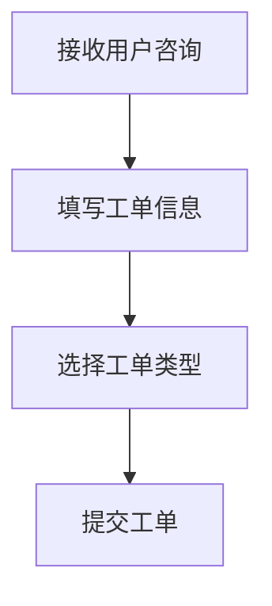
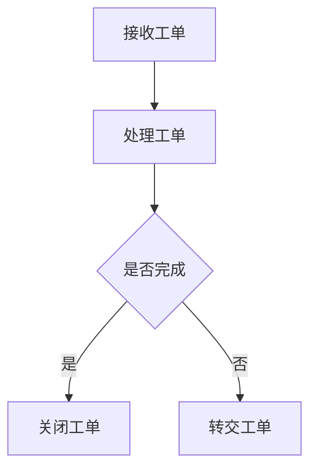

 # 咨询工单转交系统产品需求文档

| 文档信息 ||
|----|----|
| 作者 | 小美 |
| 最后更新日期 | 2025-03-21 |

## 1. 产品概述
### 1.1 产品背景
为提升客服工作效率，实现工单的合理分配和快速处理，需要开发一个咨询工单转交系统。

### 1.2 产品目标
- 提高工单处理效率
- 优化工单分配流程
- 提升客户满意度
- 实现工单全流程追踪

## 2. 功能需求
### 2.1 核心功能
#### 2.1.1 工单创建


- 工单基本信息录入
- 工单优先级设置
- 工单分类标签

#### 2.1.2 工单转交


- 转交对象选择
- 转交原因说明
- 转交记录追踪

#### 2.1.3 工单处理


### 2.2 辅助功能
- 工单搜索
- 工单统计报表
- 处理时效提醒
- 工单历史记录

## 3. 用户角色
- 管理员
- 客服人员
- 技术支持人员
- 质检人员

## 4. 界面原型
### 4.1 工单列表
```
+------------------------+
|  工单列表              |
+------------------------+
| ID | 标题 | 状态 | 操作 |
|----+------+------+------|
| 01 | xxx  | 待处理| 转交|
| 02 | xxx  | 处理中| 处理|
+------------------------+
```

### 4.2 转交界面
```
+-------------------------+
|  工单转交               |
+-------------------------+
| 转交对象: [下拉选择]    |
| 转交原因: [文本框]      |
| [确认] [取消]           |
+-------------------------+
```

## 5. 非功能需求
### 5.1 性能需求
- 系统响应时间 < 2秒
- 支持并发用户数 > 100

### 5.2 安全需求
- 用户权限管理
- 数据加密存储
- 操作日志记录

## 6. 业务规则
### 6.1 工单流转规则
- 工单必须有明确的处理人
- 转交需要填写原因
- 超时工单自动提醒

### 6.2 数据规则
- 工单号唯一性
- 必填字段验证
- 历史记录保留期限

## 7. 验收标准
- 工单转交成功率 100%
- 系统稳定运行时间 > 99.9%
- 用户操作响应时间达标

## 8. 风险评估
- 系统性能风险
- 数据安全风险
- 用户适应性风险