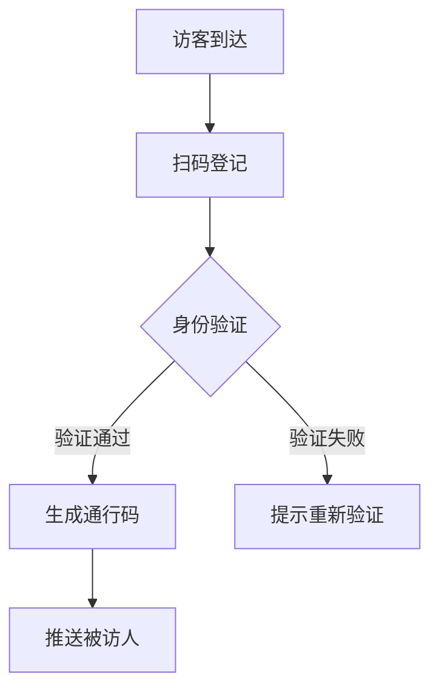

 # 小鹏智慧访客系统产品需求文档

## 1. 文档信息

| 文档状态 | 创建日期 | 最后更新日期 | 版本号 |
|----------|----------|--------------|--------|
| 编制中    | 2024-01-20 | 2024-01-20  | V1.0   |

## 2. 产品概述

### 2.1 产品定位
面向小鹏汽车各办公场所的智能访客管理系统，实现访客预约、登记、通行全流程数字化管理。

### 2.2 产品目标
- 提升访客管理效率
- 加强安全管控
- 优化访客体验
- 实现数据可视化

## 3. 功能需求

### 3.1 访客预约模块
- 访客在线预约
- 被访人审批
- 预约信息推送
- 预约记录管理

### 3.2 访客登记模块


### 3.3 通行管理模块
- 二维码通行
- 人脸识别通行
- 通行记录管理
- 异常处理机制

### 3.4 管理后台
- 访客数据统计
- 黑名单管理
- 权限管理
- 系统配置

## 4. 非功能需求

### 4.1 性能需求
- 系统响应时间 < 2秒
- 并发访问量支持 1000+
- 7*24小时稳定运行

### 4.2 安全需求
- 数据加密传输
- 访客信息脱敏
- 定期数据备份
- 访问权限控制

## 5. 界面原型

### 5.1 访客预约页面
```
+----------------------+
|     访客预约系统      |
+----------------------+
|  访客信息            |
|  [姓名____________]  |
|  [手机号__________]  |
|  [来访事由________]  |
|                      |
|  被访人信息          |
|  [姓名____________]  |
|  [部门____________]  |
|                      |
|     [提交预约]       |
+----------------------+
```

### 5.2 管理后台主界面
```
+--------------------------------+
|  小鹏访客系统管理后台           |
+--------------------------------+
| [菜单栏]        [消息] [设置]  |
|                               |
| 访客统计                       |
| [今日访客] [在访人数] [预约数] |
|                               |
| 实时动态                       |
| [访客列表___________________] |
|                               |
| 异常预警                       |
| [预警信息___________________] |
+--------------------------------+
```

## 6. 数据需求

### 6.1 数据采集
- 访客基本信息
- 预约信息
- 通行记录
- 系统日志

### 6.2 数据存储
- 访客信息表
- 预约记录表
- 通行记录表
- 系统配置表

## 7. 项目规划

### 7.1 开发周期
- 需求分析：2周
- 系统设计：2周
- 开发实现：8周
- 测试上线：4周

### 7.2 迭代计划
1. 第一期：基础预约功能
2. 第二期：通行管理功能
3. 第三期：管理后台功能
4. 第四期：数据分析功能

## 8. 风险评估

### 8.1 主要风险
- 系统安全风险
- 数据隐私风险
- 系统稳定性风险

### 8.2 应对措施
- 建立完善的安全机制
- 实施数据加密方案
- 制定应急预案