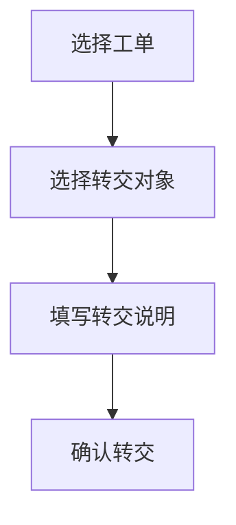

 # 咨询工单转交系统产品需求文档

| 文档信息 | |
|---------|----------|
| 作者 | 小美 |
| 最后更新日期 | 2025-03-21 |
| 文档状态 | 已审核 |

## 1. 产品概述

### 1.1 产品背景
为提高客服部门工作效率，实现工单快速、准确流转，开发咨询工单转交系统。

### 1.2 产品目标
- 提升工单处理效率
- 减少工单转交错误
- 实现工单全流程追踪
- 提高客户满意度

## 2. 功能需求

### 2.1 用户角色
- 客服人员
- 部门主管
- 系统管理员

### 2.2 核心功能

#### 2.2.1 工单创建


- 工单基本信息录入
- 支持附件上传
- 工单优先级设置
- 工单分类标签

#### 2.2.2 工单转交


- 转交对象选择
- 转交原因说明
- 转交通知提醒

#### 2.2.3 工单追踪
- 工单状态实时更新
- 处理过程记录
- 操作日志查询

### 2.3 界面原型

```
+----------------------+
|     工单管理系统     |
+----------------------+
|  [创建工单] [查询]   |
+----------------------+
| 工单列表：           |
| ID  标题  状态  操作 |
|=====================|
| 001 XXXX 处理中 转交 |
| 002 XXXX 待处理 处理 |
+----------------------+
```

## 3. 非功能需求

### 3.1 性能需求
- 系统响应时间 <2s
- 并发用户数 >100
- 系统可用性 >99.9%

### 3.2 安全需求
- 用户权限管理
- 数据加密传输
- 操作日志记录

### 3.3 可用性需求
- 界面简洁直观
- 操作步骤简化
- 支持快捷键操作

## 4. 数据需求

### 4.1 数据字典
- 工单信息
- 用户信息
- 部门信息
- 操作日志

### 4.2 数据流转
- 工单创建→审核→处理→关闭
- 数据备份与恢复机制

## 5. 其他需求

### 5.1 系统集成
- 与现有CRM系统对接
- 支持消息推送系统

### 5.2 系统配置
- 可配置工单类型
- 可配置处理流程
- 可配置提醒规则