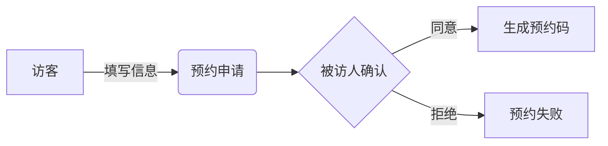

 # 小鹏访客系统产品需求文档

## 1. 文档信息

- 文档版本：V1.0
- 创建日期：2024-01-20
- 产品负责人：PM

## 2. 产品概述

### 2.1 产品背景
为提升小鹏汽车办公区域的安全管理水平，优化访客接待流程，开发访客系统。

### 2.2 产品目标
- 提升访客登记效率
- 加强办公区域安全管理
- 数字化访客记录管理
- 提升访客体验

## 3. 功能需求

### 3.1 访客预约
- 在线预约入口
- 访客信息登记
- 预约时间选择
- 来访事由填写
- 被访人确认机制

### 3.2 访客签到
- 身份证识别
- 人脸采集
- 健康码查验（可选）
- 访客须知确认
- 电子访客证生成

### 3.3 访客管理
- 实时访客状态查看
- 历史访客记录查询
- 黑名单管理
- 访客数据统计
- 异常情况预警

### 3.4 系统管理
- 角色权限配置
- 部门管理
- 员工管理
- 系统参数设置
- 日志管理

## 4. 系统原型

### 4.1 访客预约流程


### 4.2 访客签到界面
```
+------------------------+
|     访客签到系统       |
+------------------------+
|   [ 身份证识别区域 ]   |
|                        |
|   [ 人脸采集区域 ]     |
|                        |
|   [ 确认按钮 ]        |
+------------------------+
```

## 5. 非功能需求

### 5.1 性能需求
- 系统响应时间：<2秒
- 并发访问量：支持100人同时在线
- 系统可用性：99.9%

### 5.2 安全需求
- 数据加密传输
- 访客信息脱敏处理
- 权限分级管理
- 操作日志记录

### 5.3 兼容性要求
- 支持主流浏览器
- 移动端适配
- 支持主流身份证识别设备

## 6. 项目规划

### 6.1 开发周期
- 需求确认：1周
- 开发周期：8周
- 测试周期：2周
- 上线准备：1周

### 6.2 优先级
P0：基础访客登记功能
P1：预约管理功能
P2：数据统计分析功能
P3：系统集成优化

## 7. 验收标准
- 访客预约到访完整流程打通
- 身份证识别准确率>99%
- 人脸采集成功率>95%
- 系统数据统计准确
- 安全性测试通过