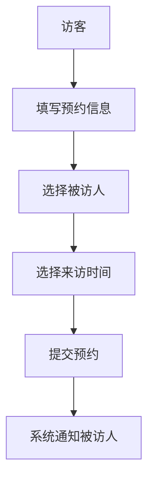

 # 小鹏访客系统产品需求说明书

## 1. 文档信息

- 文档版本: V1.0
- 创建日期: 2024-01-20
- 产品负责人: PM

## 2. 产品概述

### 2.1 产品背景
为提升小鹏汽车办公场所的安全管理水平，提高访客登记效率，开发专业的访客管理系统。

### 2.2 产品目标
- 实现访客登记全流程数字化
- 提高访客登记效率
- 加强企业安保管理
- 优化访客体验

## 3. 功能需求

### 3.1 访客预约


#### 3.1.1 预约信息录入
- 访客基本信息
  - 姓名
  - 手机号
  - 身份证号
  - 公司名称
- 来访目的
- 预计到访时间
- 预计离开时间

#### 3.1.2 预约审批流程
- 被访人审批
- 部门主管审批（可选）
- 保安确认

### 3.2 访客签到

#### 3.2.1 到访登记
```
+----------------+
|   访客签到界面  |
|  +----------+  |
|  |扫码签到  |  |
|  +----------+  |
|  +----------+  |
|  |人脸识别  |  |
|  +----------+  |
+----------------+
```

- 扫描预约二维码
- 人脸识别
- 身份证验证
- 自动通知被访人

#### 3.2.2 访客证管理
- 自动生成电子访客证
- 实体访客证打印（可选）
- 访客证有效期管理

### 3.3 在访管理
- 访客实时位置记录
- 异常行为预警
- 超时提醒
- 紧急情况处理

### 3.4 离访管理
- 访客签出登记
- 访客证注销
- 访问记录存档

### 3.5 系统管理
- 用户权限管理
- 黑名单管理
- 访客数据统计
- 系统配置管理

## 4. 非功能需求

### 4.1 性能需求
- 系统响应时间 < 2秒
- 并发访问量支持 1000+ 
- 7*24小时稳定运行

### 4.2 安全需求
- 数据加密存储
- 访客信息脱敏
- 操作日志记录
- 权限分级管理

### 4.3 可用性需求
- 系统可用性 99.9%
- 故障恢复时间 < 30分钟
- 数据备份策略

## 5. 界面需求

### 5.1 访客端界面
```
+-----------------+
|    访客系统     |
|-----------------| 
| [预约登记]      |
| [签到/签出]     |
| [我的证件]      |
| [帮助中心]      |
+-----------------+
```

### 5.2 管理端界面
```
+------------------+
|    后台管理      |
|------------------| 
| [访客管理]       |
| [预约审批]       |
| [统计分析]       |
| [系统设置]       |
+------------------+
```

## 6. 数据需求

### 6.1 数据存储
- 访客基础信息
- 预约记录
- 通行记录
- 审批流程
- 系统配置

### 6.2 数据接口
- 人力系统集成
- 门禁系统对接
- 安防系统对接

## 7. 其他需求

### 7.1 法务合规
- 访客隐私保护
- 数据存储合规
- 访客须知确认

### 7.2 运维需求
- 系统监控
- 故障告警
- 数据备份
- 版本更新