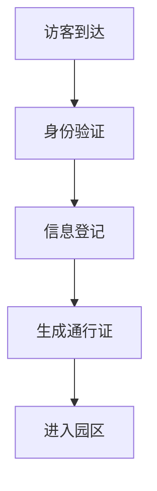

 # 小鹏访客系统产品需求文档

## 1. 文档信息

- 文档版本: v1.0
- 作者: PM
- 最后更新: 2024-01-01

## 2. 产品概述

### 2.1 产品定位
面向小鹏汽车办公场所的智能访客管理系统，提供访客预约、来访登记、访问管理等功能。

### 2.2 产品目标
- 提升访客管理效率
- 增强企业安全管控
- 优化访客体验
- 数字化访客记录

## 3. 功能需求

### 3.1 访客预约
- 访客在线预约
- 员工预约邀请
- 预约审批流程
- 预约确认通知

### 3.2 访客登记
- 身份证识别
- 人脸采集
- 健康码查验
- 访问目的登记
- 访问区域选择
- 电子承诺书签署

### 3.3 通行管理
- 临时通行证生成
- 二维码通行
- 访问区域限制
- 访问时间控制

### 3.4 系统管理
- 访客数据统计
- 黑名单管理
- 员工权限管理
- 访问记录导出

## 4. 系统原型

### 4.1 访客登记流程


### 4.2 预约界面原型
```
+----------------------+
|     访客预约系统     |
+----------------------+
| 访客姓名: [________] |
| 手机号:   [________] |
| 来访时间: [日期选择] |
| 来访事由: [________] |
| 接待人:   [员工选择] |
|                      |
| [提交预约]  [取消]   |
+----------------------+
```

## 5. 非功能需求

### 5.1 性能需求
- 系统响应时间 < 2秒
- 支持并发访问量 > 100人/分钟
- 7×24小时稳定运行

### 5.2 安全需求
- 数据加密存储
- 访客信息脱敏
- 权限分级管理
- 操作日志记录

### 5.3 兼容性要求
- 支持主流浏览器
- 支持移动端访问
- 支持各类身份证读卡器

## 6. 项目规划

### 6.1 开发周期
- 需求确认: 1周
- 开发周期: 8周
- 测试周期: 2周
- 部署上线: 1周

### 6.2 验收标准
- 功能完整性测试通过
- 性能指标达标
- 安全测试通过
- 用户体验评估合格

## 7. 附录

### 7.1 术语说明
- 临时通行证：访客进入园区的电子凭证
- 黑名单：禁止进入园区的访客名单
- 脱敏：对敏感信息进行加密或隐藏处理

### 7.2 相关文档
- 《访客管理制度》
- 《安全管理规范》
- 《数据保护方案》