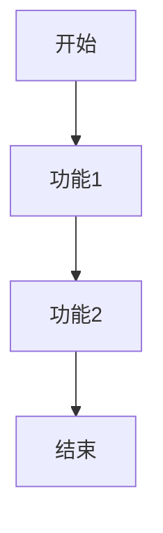

 # 产品需求文档

## 文档信息
- 作者：小美
- 最后更新日期：2025-03-21

## 1. 需求背景

### 1.1 市场背景
暂无具体需求输入，等待补充。

### 1.2 产品目标
暂无具体需求输入，等待补充。

## 2. 功能需求

### 2.1 核心功能
暂无具体需求输入，等待补充。

### 2.2 功能详情
暂无具体需求输入，等待补充。

## 3. 原型设计

### 3.1 页面布局
```
+------------------+
|     Header       |
+------------------+
|                  |
|      Main        |
|     Content      |
|                  |
+------------------+
|     Footer       |
+------------------+
```

### 3.2 交互流程


## 4. 非功能需求

### 4.1 性能需求
- 页面加载时间不超过3秒
- 系统稳定性99.9%

### 4.2 安全需求
- 数据传输加密
- 用户信息保护

## 5. 验收标准
暂无具体需求输入，等待补充。

## 6. 补充说明
- 本文档将根据具体需求持续更新
- 如有疑问请及时反馈