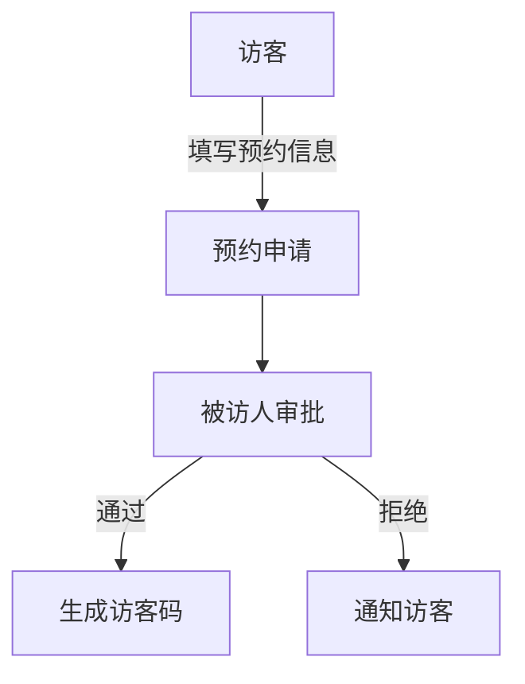

 # 小鹏访客系统产品需求文档

## 1. 文档信息

- 文档状态：草稿
- 版本号：V1.0
- 作者：Product Manager
- 最后更新日期：2024-01-20

## 2. 产品概述

### 2.1 产品背景
为提升小鹏公司访客管理效率，优化访客体验，建立规范化的访客管理流程。

### 2.2 产品目标
- 实现访客预约、登记的线上化
- 提高访客通行效率
- 加强企业安全管理
- 改善访客体验

## 3. 功能需求

### 3.1 访客预约


#### 3.1.1 预约信息填写
- 访客姓名
- 手机号码
- 来访目的
- 预约时间
- 被访人信息
- 随行人员信息（选填）

#### 3.1.2 预约审批流程
- 被访人接收预约通知
- 在线审批
- 自动通知访客审批结果

### 3.2 访客登记

#### 3.2.1 现场登记
```
+----------------+
|   访客登记界面  |
|  +----------+  |
|  | 扫码登记 |  |
|  +----------+  |
|  +----------+  |
|  | 人工登记 |  |
|  +----------+  |
+----------------+
```

- 身份证识别
- 人脸采集
- 健康码核验
- 访客须知确认

### 3.3 通行管理
- 电子访客码
- 临时门禁卡
- 访客轨迹记录

### 3.4 系统管理
- 访客数据统计
- 黑名单管理
- 员工管理
- 权限配置

## 4. 非功能需求

### 4.1 性能需求
- 系统响应时间：<3秒
- 并发访问量：支持1000人同时在线
- 数据备份：每日进行

### 4.2 安全需求
- 数据加密传输
- 访客信息脱敏处理
- 定期数据备份
- 访问权限控制

## 5. 界面需求

### 5.1 访客端界面
```
+-----------------+
|    访客系统     |
+-----------------+
| □ 预约登记      |
| □ 访客码        |
| □ 预约记录      |
| □ 通行记录      |
+-----------------+
```

### 5.2 管理端界面
```
+------------------+
|    后台管理      |
+------------------+
| □ 访客管理       |
| □ 预约审批       |
| □ 数据统计       |
| □ 系统设置       |
+------------------+
```

## 6. 项目里程碑

| 阶段 | 时间节点 | 主要内容 |
|------|----------|---------|
| 需求分析 | T+2周 | 完成需求调研和文档 |
| 产品设计 | T+4周 | 完成产品原型 |
| 开发实现 | T+12周 | 完成系统开发 |
| 测试运营 | T+14周 | 完成系统测试 |
| 正式上线 | T+16周 | 系统正式发布 |

## 7. 风险评估

| 风险点 | 可能性 | 影响度 | 应对措施 |
|--------|--------|--------|----------|
| 系统安全性 | 高 | 高 | 加强安全防护 |
| 用户接受度 | 中 | 高 | 加强培训推广 |
| 系统稳定性 | 中 | 高 | 做好容灾备份 |

## 8. 验收标准

- 访客预约成功率≥99%
- 系统可用性≥99.9%
- 用户满意度≥95%
- 访客登记时间≤3分钟