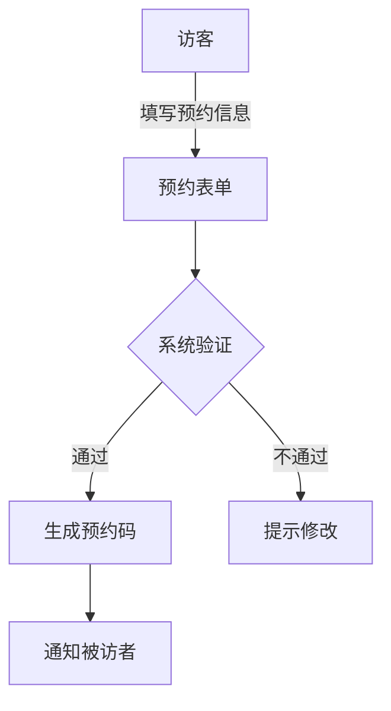

 # 小鹏访客系统产品需求说明书

## 1. 文档信息

- 文档版本：V1.0
- 创建日期：2024-01-01
- 产品负责人：PM

## 2. 产品概述

### 2.1 产品定位
面向小鹏汽车办公场所的智能访客管理系统，提供访客预约、来访登记、身份验证等功能。

### 2.2 目标用户
- 访客
- 企业员工
- 前台接待
- 安保人员
- 系统管理员

## 3. 功能需求

### 3.1 访客预约


#### 3.1.1 预约信息填写
- 访客姓名
- 手机号码
- 来访目的
- 预计到访时间
- 被访者信息
- 随行人员信息

#### 3.1.2 预约审批流程
- 被访者审批
- 安保审核（特殊区域）
- 自动生成访客码

### 3.2 访客登记

#### 3.2.1 到访登记
- 身份证识别
- 人脸采集
- 健康码核验
- 访客须知确认
- 访客证发放

#### 3.2.2 系统功能
- 自动比对预约信息
- 生成电子访客证
- 记录登记时间
- 发送通知给被访者

### 3.3 访问管理

#### 3.3.1 权限控制
- 区域访问权限设置
- 时间限制管理
- 电梯楼层控制
- 门禁授权

#### 3.3.2 访问监控
- 实时位置追踪
- 异常行为提醒
- 超时预警
- 访问记录存档

### 3.4 离场管理
- 访客证回收
- 满意度调查
- 自动注销权限
- 记录离场时间

## 4. 非功能需求

### 4.1 性能需求
- 系统响应时间 < 2秒
- 并发处理能力 > 100人/分钟
- 人脸识别准确率 > 99%
- 系统可用性 > 99.9%

### 4.2 安全需求
- 数据加密存储
- 访客信息脱敏
- 权限分级管理
- 操作日志记录

### 4.3 兼容性要求
- 支持主流浏览器
- 移动端适配
- 支持多种身份证读取设备
- 兼容现有门禁系统

## 5. 界面原型

### 5.1 访客预约界面
```
+------------------------+
|     访客预约系统        |
+------------------------+
| 姓名: [          ]     |
| 手机: [          ]     |
| 来访时间: [日期选择器]  |
| 被访者: [搜索选择]     |
| 来访事由: [        ]   |
+------------------------+
|      [提交预约]        |
+------------------------+
```

### 5.2 前台登记界面
```
+-------------------------+
|      访客登记处         |
+-------------------------+
|   [身份证读取区域]      |
|   [人脸采集区域]        |
|                         |
| 预约号码:[         ]    |
| 健康码: [上传]          |
+-------------------------+
|      [确认登记]         |
+-------------------------+
```

## 6. 数据需求

### 6.1 数据采集
- 访客基本信息
- 预约记录
- 进出记录
- 位置数据
- 操作日志

### 6.2 数据存储
- 访客信息库
- 员工信息库
- 预约记录库
- 访问记录库

### 6.3 数据处理
- 实时数据分析
- 访客流量统计
- 异常行为识别
- 报表生成

## 7. 项目规划

### 7.1 开发周期
- 需求分析：2周
- 系统设计：2周
- 开发实现：8周
- 测试部署：4周

### 7.2 优先级
1. 访客预约功能
2. 现场登记功能
3. 权限管理功能
4. 监控管理功能
5. 统计分析功能

## 8. 风险评估

### 8.1 主要风险
- 系统安全风险
- 数据泄露风险
- 系统稳定性风险
- 用户适应性风险

### 8.2 应对措施
- 定期安全审计
- 数据加密传输
- 系统备份机制
- 分步骤推广使用