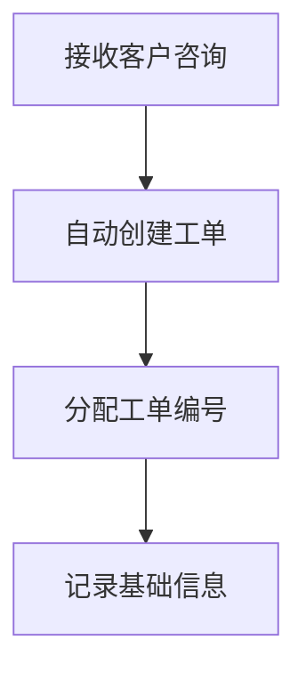
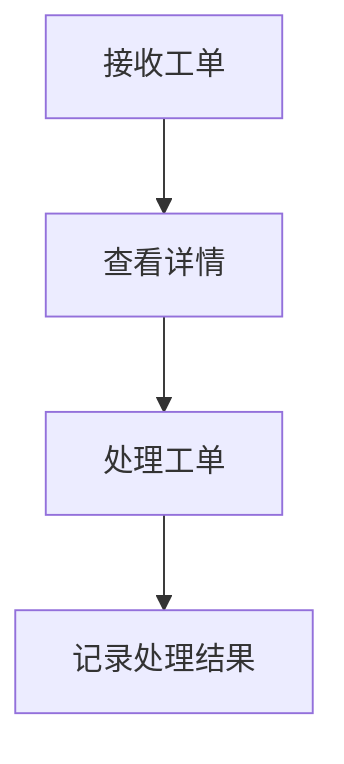

 # 咨询工单转交系统产品需求文档

- 文档作者：小美
- 最后更新：2025-03-22
- 文档状态：草稿
- 文档版本：v1.0

## 1. 文档目的

本文档旨在详细描述咨询工单转交系统的功能需求和用户界面，为开发团队提供明确的产品设计指导。

## 2. 产品概述

### 2.1 产品定义
咨询工单转交系统是一个面向客服团队的工单管理与转交平台，用于处理客户咨询请求的分配、转交和跟踪。

### 2.2 产品目标
- 提高客服团队工作效率
- 减少工单响应时间
- 优化客户服务体验
- 实现工单处理过程的可追踪性

## 3. 功能需求

### 3.1 核心功能

#### 3.1.1 工单创建


- 自动生成工单编号
- 记录客户基本信息
- 记录咨询内容
- 设置工单优先级

#### 3.1.2 工单转交


- 支持选择转交对象
- 必填转交原因
- 记录转交历史
- 通知相关人员

#### 3.1.3 工单处理


### 3.2 辅助功能

- 工单搜索
- 数据统计
- 工单导出
- 处理记录查询

## 4. 界面原型

### 4.1 工单列表页
```
+------------------+
|  工单列表        |
+------------------+
| ID  状态  客户   |
|------------------|
| #1  待处理 张三  |
| #2  处理中 李四  |
| #3  已完成 王五  |
+------------------+
```

### 4.2 工单详情页
```
+-------------------------+
|  工单详情               |
+-------------------------+
| 工单号：#12345         |
| 客户：张三             |
| 状态：处理中           |
| 内容：                 |
|                        |
| 处理记录：             |
|                        |
| 转交按钮 处理按钮      |
+-------------------------+
```

## 5. 非功能需求

### 5.1 性能需求
- 页面加载时间 < 3秒
- 支持并发用户数 > 100
- 系统可用性 > 99.9%

### 5.2 安全需求
- 用户权限管理
- 数据加密存储
- 操作日志记录

### 5.3 兼容性要求
- 支持主流浏览器
- 支持移动端访问

## 6. 数据需求

### 6.1 数据字典
- 工单状态：待处理、处理中、已完成
- 优先级：低、中、高、紧急

### 6.2 数据报表
- 工单处理统计
- 转交记录统计
- 处理时效分析

## 7. 附录

### 7.1 术语表
- 工单：客户咨询的处理单元
- 转交：将工单分配给其他处理人
- 处理人：负责处理工单的客服人员