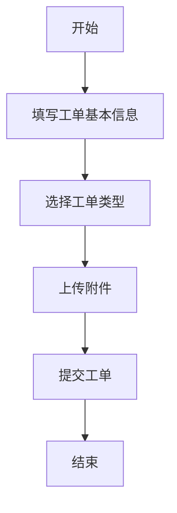

 # 咨询工单转交系统产品需求文档

## 文档信息
- 作者：小美
- 最后更新日期：2025-03-21
- 文档状态：已评审

## 1. 产品概述

### 1.1 产品背景
为提高客服工作效率，实现工单快速精准流转，需要开发一个咨询工单转交系统。

### 1.2 产品目标
- 提升工单处理效率
- 降低工单转交错误率
- 优化客服工作体验

## 2. 功能需求

### 2.1 工单创建


#### 2.1.1 基本信息
- 工单标题
- 客户信息
- 问题描述
- 优先级

#### 2.1.2 工单类型
- 咨询类
- 投诉类
- 建议类
- 其他类

### 2.2 工单转交


#### 2.2.1 转交规则
- 按部门转交
- 按人员转交
- 按技能组转交

#### 2.2.2 转交流程
- 转交时必填转交原因
- 支持批量转交
- 转交后自动通知

### 2.3 工单处理
- 工单接收确认
- 处理过程记录
- 处理结果反馈

## 3. 非功能需求

### 3.1 性能需求
- 页面加载时间<3秒
- 系统支持并发数>1000

### 3.2 安全需求
- 角色权限控制
- 数据加密传输
- 操作日志记录

## 4. 界面原型

### 4.1 工单列表页
```
+----------------------+
|  工单列表           |
+----------------------+
| 搜索栏 [________]   |
+----------------------+
| ID  标题  状态  操作|
|  1  xxx   处理中 转交|
|  2  xxx   待处理 转交|
+----------------------+
```

### 4.2 转交页面
```
+----------------------+
|  工单转交           |
+----------------------+
| 转交至: [下拉选择]  |
| 转交原因:           |
| [________________]  |
|                     |
| [取消]    [确认]    |
+----------------------+
```

## 5. 数据结构

### 5.1 工单表
- 工单ID
- 标题
- 内容
- 状态
- 创建时间
- 处理人

### 5.2 转交记录表
- 记录ID
- 工单ID
- 转交人
- 接收人
- 转交时间
- 转交原因

## 6. 技术要求
- 前端：Vue.js
- 后端：Spring Boot
- 数据库：MySQL
- 缓存：Redis

## 7. 验收标准
- 工单创建成功率100%
- 转交准确率>99%
- 系统稳定运行>99.9%