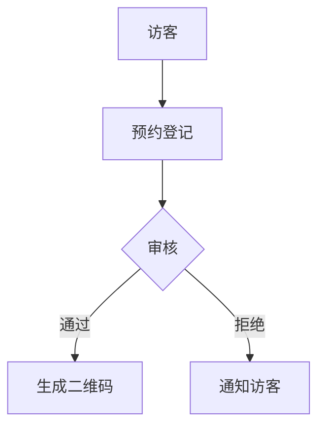
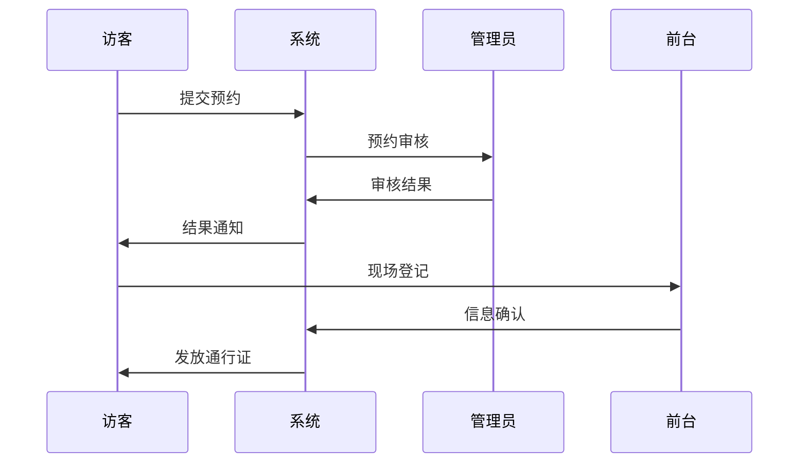

 # 小鹏访客系统产品需求文档

## 1. 文档信息

- 文档版本: V1.0
- 产品名称: 小鹏访客系统
- 文档状态: 初稿
- 撰写日期: 2024年

## 2. 产品概述

### 2.1 产品定位
面向小鹏汽车公司的访客管理系统，用于规范化管理来访人员，提升访客体验和安全管理水平。

### 2.2 产品目标
- 实现访客预约、登记的数字化管理
- 提高访客通行效率
- 加强企业安全管理
- 优化访客体验

## 3. 功能需求

### 3.1 访客预约模块


#### 功能点：
- 在线预约登记
- 预约信息审核
- 预约确认通知
- 访问码生成

### 3.2 访客登记模块
```
+---------------+
|   访客登记    |
+---------------+
| 1.身份验证    |
| 2.信息采集    |
| 3.照片采集    |
| 4.通行证发放  |
+---------------+
```

#### 功能点：
- 身份证识别
- 人脸采集
- 访客信息录入
- 访客证件打印

### 3.3 访客管理模块
- 访客记录查询
- 访客状态跟踪
- 黑名单管理
- 访客统计分析

### 3.4 系统设置模块
- 用户权限管理
- 审批流程配置
- 访问区域设置
- 系统参数配置

## 4. 非功能需求

### 4.1 性能需求
- 系统响应时间：<3秒
- 并发处理能力：>100人/分钟
- 系统可用性：99.9%

### 4.2 安全需求
- 数据加密存储
- 访问权限控制
- 操作日志记录
- 敏感信息脱敏

### 4.3 兼容性要求
- 支持主流浏览器
- 支持移动端访问
- 支持常见身份证读卡器

## 5. 系统界面

### 5.1 访客预约界面
```
+-----------------+
|  访客预约系统   |
+-----------------+
| 姓名：[      ]  |
| 电话：[      ]  |
| 时间：[      ]  |
| 事由：[      ]  |
|                 |
| [提交预约按钮]  |
+-----------------+
```

### 5.2 访客登记界面
```
+------------------+
|   访客登记      |
+------------------+
|  □ 身份信息     |
|  □ 访问信息     |
|  □ 照片采集     |
|                  |
| [确认登记按钮]   |
+------------------+
```

## 6. 业务流程


## 7. 项目实施

### 7.1 开发周期
- 需求分析：2周
- 系统设计：2周
- 开发实现：8周
- 测试部署：2周

### 7.2 优先级排序
1. 访客预约登记
2. 现场登记管理
3. 访客数据管理
4. 统计分析功能

## 8. 风险评估
- 系统安全风险
- 数据隐私风险
- 系统稳定性风险
- 用户适应性风险

## 9. 验收标准
- 功能完整性测试通过
- 性能指标达标
- 安全要求满足
- 用户体验良好