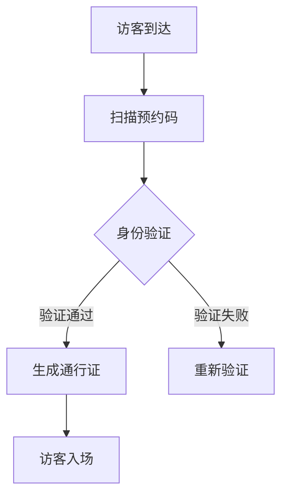

 # 小鹏访客系统产品需求文档

## 1. 文档信息

| 文档信息 | 说明 |
|----------|------|
| 产品名称 | 小鹏访客系统 |
| 文档版本 | V1.0 |
| 作者 | PM |
| 最后更新 | 2024-01-20 |

## 2. 产品概述

### 2.1 产品定位
面向小鹏汽车办公场所的智能访客管理系统，提供访客预约、登记、通行管理的一站式解决方案。

### 2.2 产品目标
- 提升访客管理效率
- 加强办公安全管控
- 优化访客体验
- 数字化访客数据管理

## 3. 功能需求

### 3.1 访客预约
- 访客在线预约
- 被访人审批
- 预约信息推送
- 预约码生成

### 3.2 访客登记
- 身份证识别
- 人脸采集
- 访问目的登记
- 健康码核验
- 访客须知确认

### 3.3 通行管理


### 3.4 后台管理
- 访客记录查询
- 黑名单管理
- 访客统计分析
- 系统配置管理

## 4. 非功能需求

### 4.1 性能需求
- 系统响应时间 < 2秒
- 支持并发访问量 > 1000
- 7*24小时稳定运行

### 4.2 安全需求
- 数据加密存储
- 访问权限控制
- 操作日志记录
- 数据备份机制

## 5. 界面原型

### 5.1 访客预约界面
```
+------------------------+
|   访客预约            |
+------------------------+
| 访客信息              |
| [-姓名--------------] |
| [-手机号------------] |
| [-来访时间----------] |
| [-来访事由----------] |
|                        |
| [     提交预约     ]  |
+------------------------+
```

### 5.2 管理后台界面
```
+-------------------+----------------------+
|  菜单栏          |  内容区             |
|  访客记录        |                      |
|  黑名单管理      |                      |
|  统计分析        |                      |
|  系统设置        |                      |
+-------------------+----------------------+
```

## 6. 迭代计划

### 第一期（核心功能）
- 访客预约
- 基础登记
- 通行管理

### 第二期（增强功能）
- 统计分析
- 系统管理
- 移动端适配

## 7. 风险评估

| 风险点 | 影响程度 | 应对措施 |
|--------|----------|----------|
| 系统稳定性 | 高 | 做好容灾备份 |
| 数据安全 | 高 | 加密传输存储 |
| 用户体验 | 中 | 优化交互流程 |

## 8. 验收标准

- 支持每日1000人次访客处理
- 访客登记时间<3分钟
- 系统可用性>99.9%
- 数据安全无泄露事件